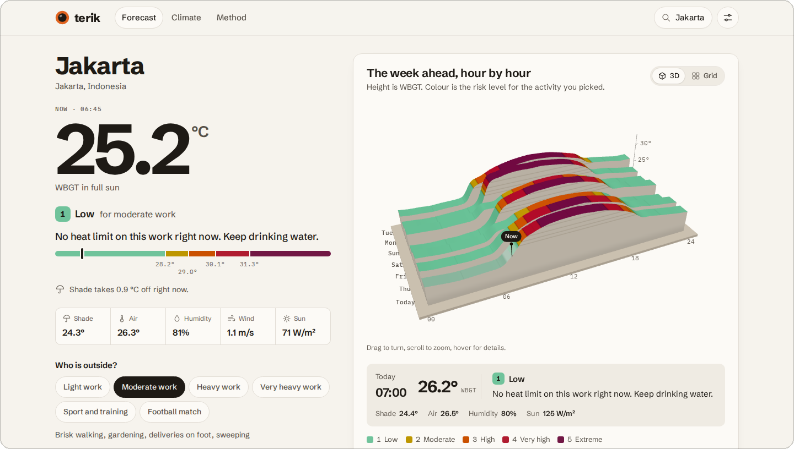
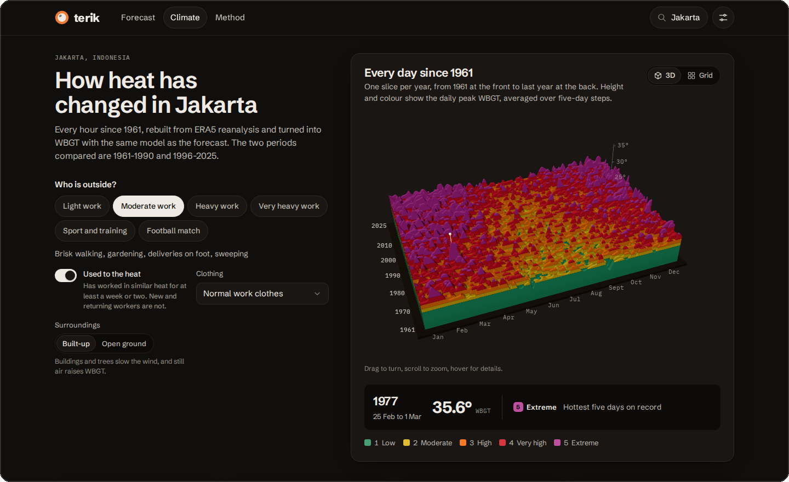
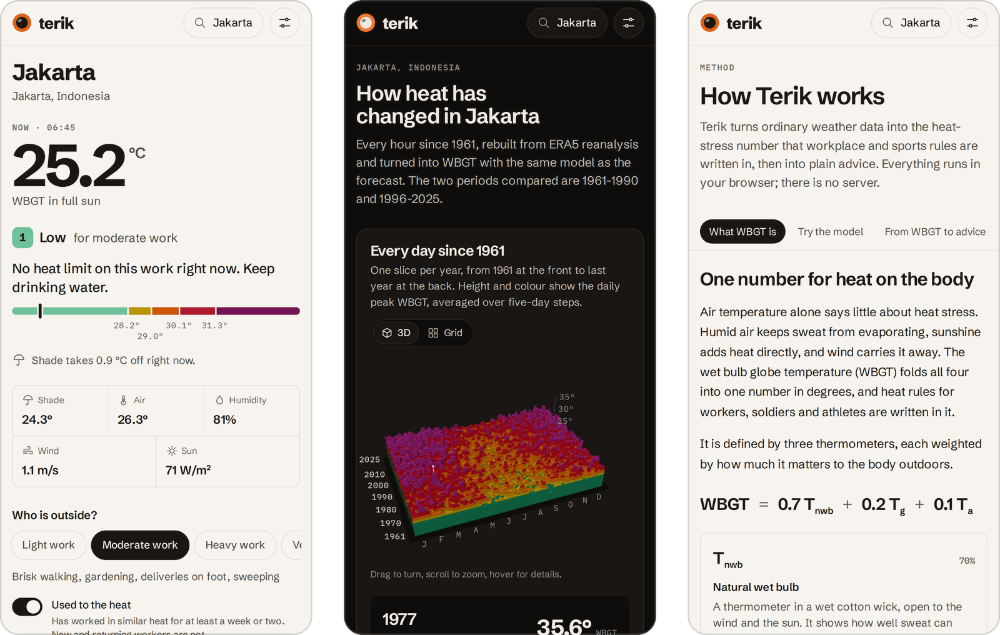

# Terik

Terik forecasts heat stress for people who work, train or play outside. It takes the hourly forecast for any place on Earth, works out the wet bulb globe temperature (WBGT) that workplace and sports heat rules are written in, and turns it into advice for the activity you pick: how many minutes of each hour can be work, whether training should be cut short, when a football match needs cooling breaks. A second page rebuilds every hour since 1961 from reanalysis data to show how heat stress in that place has changed.

The name is the Indonesian word for the scorching heat of the sun.

Live at [raffagmd-terik.netlify.app](https://raffagmd-terik.netlify.app). All of the calculation happens in your browser; there is no server, account or tracking.



_The screenshots use the synthetic weather that the test suite serves in place of the real APIs, so their numbers are not a real forecast or record for Jakarta._

## What it does

- Seven days of hourly WBGT in full sun and in shade, as a 3D surface, a grid and a table, coloured by five risk levels. The levels depend on the activity: four work rates from light to very heavy, sport and training, or a football match. Acclimatisation, protective clothing and built-up or open surroundings change the result.
- The same model runs on every member of the DWD ICON ensemble, up to 40 runs, which gives an uncertainty band and the chance that an hour turns out a level worse than forecast.
- A planner finds the coolest stretch of the week for an activity of a given length inside the hours you choose, judges each stretch by its hottest hour, and exports the result to your calendar.
- The climate page downloads about 65 years of hourly ERA5 data (around 5 MB) and converts it to WBGT on your device. It counts the hot days and the hours lost to heat in each year and tests both for a trend, compares the seasonal cycle of 1961-1990 with the last 30 complete years, and shows how often the old 1-in-20-year peak comes around now. The record is saved in the browser and can be exported as CSV.
- The method page explains each step and cites its sources. It has the WBGT model running live under a set of sliders.

The app is in English and Indonesian, shows Celsius or Fahrenheit, and has light and dark themes.





## How it works

WBGT is 0.7 × natural wet bulb + 0.2 × black globe + 0.1 × air temperature. Weather forecasts do not include the first two, so Terik computes them with the heat and mass transfer model of Liljegren and colleagues (2008), ported to TypeScript from Argonne National Laboratory's C code. The model balances the heat a wet wick and a black globe gain from the sun, the sky and the ground against what they lose to the air. Forecast wind is given at 10 m, so it is first brought down to 2 m with a profile that depends on the sky, the time of day and the surroundings. Hourly sunshine is an average over the past hour, and the sun's angle is averaged over the sunlit part of the same hour (Hogan and Hirahara 2016); without that, hours around sunrise and sunset come out far off.

The advice follows published limits. Work uses the NIOSH recommended and action limits, `56.7 - 11.5 log10(M)` and `59.9 - 14.1 log10(M)` for a metabolic rate M in watts, with the ACGIH clothing adjustments. Terik finds the largest share of each hour that can be work while the hourly average stays within the limit, in 5-minute steps. Sport uses the three regional categories of Grundstein and colleagues (2015), adopted by the American College of Sports Medicine; a place gets its category from the 90th percentile of its own warm-season daily peaks once its heat record is built, and from latitude and altitude until then. Football follows FIFPRO: cooling breaks from 26 °C WBGT and a delayed or postponed match from 28 °C.

The heat record comes from Open-Meteo's archive, with temperature and humidity from ERA5-Land and wind and sunshine from ERA5. It is fetched in five-year blocks paced to stay inside the free limits, kept in IndexedDB, and processed in a pool of web workers. Trends use the Mann-Kendall test with the Hamed and Rao correction for autocorrelation, and Theil-Sen slopes. Return periods come from L-moment fits of the generalised extreme value distribution, with 1,000 bootstrap resamples for the uncertainty range.

## How it was checked

| Part                   | Compared against                                                         | Result                                                                |
| ---------------------- | ------------------------------------------------------------------------ | --------------------------------------------------------------------- |
| WBGT model             | The original C program, compiled in double precision, 3,000 random cases | 2,943 agree to within 1e-10 °C; the other 57 fail to converge in both |
| Sun position           | NREL SPA through pvlib, 1,500 random times and places                    | Elevation within 0.011°                                               |
| Hourly sun angle       | Numerical integration over each hour                                     | Within 0.002 in cosine of the zenith angle                            |
| Trend tests and slopes | pyMannKendall                                                            | Six decimal places or better                                          |
| Extreme value fits     | lmoments3 and SciPy                                                      | Five decimal places or better                                         |

The scripts that produced the reference values are in [`validation/`](validation). Vitest runs the comparisons on every push. Playwright drives the three pages at desktop and phone sizes against stand-in APIs, under the same Content Security Policy as the live site, and runs an axe accessibility scan on each.

### A day off in leap years

The `solarposition()` routine that ships with Liljegren's program counts days since J2000 as `365 * dy + dy / 4`, plus one after 2000. For every date in a leap year after 2000, 2024 included, that count is one day too high, so the sun is placed where it will be a day later, up to 0.4° out in elevation around the equinoxes. Terik takes the day count from the timestamp instead. A reference path keeps the original arithmetic, which lets the tests match the C program exactly while the forecasts use the corrected sun.

## Running it

You need Node 22 or newer.

```sh
npm ci
npm run dev        # http://localhost:5173
```

```sh
npm test           # unit tests, including the comparisons above
npm run e2e        # browser tests (run `npx playwright install chromium` once first)
npm run lint
npm run typecheck
npm run build      # production build in dist/
```

Regenerating the reference values needs gcc and Python with numpy, pandas, pvlib, pymannkendall, lmoments3 and scipy:

```sh
python3 validation/generate.py
python3 validation/generate_stats.py
```

## Deploying

[`netlify.toml`](netlify.toml) holds what Netlify needs: the build command, the single-page redirect and the security headers. The Content Security Policy lets the page connect only to Open-Meteo and BigDataCloud. `vite preview` sends the same headers, so the browser tests run under that policy, and a unit test fails if the inline theme script in `index.html` and its hash in the policy drift apart. The build also publishes `NOTICE.txt` and `third-party-licenses.txt` next to the site.

## Project layout

```text
src/lib/physics    WBGT model and sun position
src/lib/guidance   NIOSH limits, sport and football thresholds
src/lib/stats      trend tests, extreme value fits, bootstrap
src/lib/climate    heat record analysis and CSV export
src/lib/planner    best-window search and calendar export
src/data           Open-Meteo clients, request pacing, IndexedDB cache
src/workers        web worker that runs the model
src/ui             pages, charts and the two 3D scenes (React Three Fiber)
e2e                Playwright tests and the stand-in APIs
validation         scripts that produce the reference values
```

## Limits

Forecasts and reanalysis describe grid cells several kilometres across. A car park, a roof or a field without shade can be hotter than any of them, and reanalysis smooths the hottest days a little, so the heat record errs on the mild side. The advice is written for healthy adults; children, older people, pregnancy, illness and some medicines lower heat tolerance. Terik is a planning aid, not medical advice. If someone shows signs of heat illness, follow the first-aid steps on the forecast page.

## Credits and licence

Made by Raffa Gamadan Rifandi. The code is under the MIT licence; see [`LICENSE`](LICENSE).

The WBGT model is derived from WBGT version 1.1 by James C. Liljegren, copyright 2008 UChicago Argonne, LLC, and keeps its own licence, reproduced in [`NOTICE`](NOTICE) and at the top of the two source files. This product includes software produced by UChicago Argonne, LLC under Contract No. DE-AC02-06CH11357 with the Department of Energy.

Weather data by [Open-Meteo.com](https://open-meteo.com) under CC BY 4.0. Contains modified Copernicus Climate Change Service information (ERA5 and ERA5-Land). Place names from GeoNames under CC BY 4.0. The fonts are Schibsted Grotesk and IBM Plex Mono under the SIL Open Font License.

To cite Terik, use GitHub's "Cite this repository" button, which reads [`CITATION.cff`](CITATION.cff).

## Main references

1. Liljegren JC, Carhart RA, Lawday P, Tschopp S, Sharp R. Modeling the wet bulb globe temperature using standard meteorological measurements. J Occup Environ Hyg. 2008;5(10):645-655. https://doi.org/10.1080/15459620802310770
2. Hogan RJ, Hirahara S. Effect of solar zenith angle specification in models on mean shortwave fluxes and stratospheric temperatures. Geophys Res Lett. 2016;43(1):482-488. https://doi.org/10.1002/2015GL066868
3. NIOSH. Criteria for a recommended standard: occupational exposure to heat and hot environments. DHHS (NIOSH) Publication 2016-106. https://doi.org/10.26616/NIOSHPUB2016106
4. Grundstein A, Williams C, Phan M, Cooper E. Regional heat safety thresholds for athletics in the contiguous United States. Appl Geogr. 2015;56:55-60. https://doi.org/10.1016/j.apgeog.2014.10.014
5. Roberts WO, Armstrong LE, Sawka MN, Yeargin SW, Heled Y, O'Connor FG. ACSM expert consensus statement on exertional heat illness. Curr Sports Med Rep. 2023;22(4):134-149. https://doi.org/10.1249/JSR.0000000000001058
6. Hamed KH, Rao AR. A modified Mann-Kendall trend test for autocorrelated data. J Hydrol. 1998;204(1-4):182-196. https://doi.org/10.1016/S0022-1694(97)00125-X
7. Hosking JRM. L-moments: analysis and estimation of distributions using linear combinations of order statistics. J R Stat Soc B. 1990;52(1):105-124. https://doi.org/10.1111/j.2517-6161.1990.tb01775.x
8. Hersbach H, Bell B, Berrisford P, et al. The ERA5 global reanalysis. Q J R Meteorol Soc. 2020;146(730):1999-2049. https://doi.org/10.1002/qj.3803

The method page in the app lists all fifteen sources.
